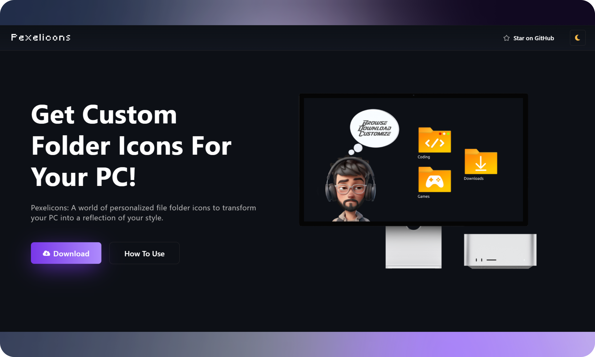

Pexelicons is a website that offers custom folder icons for Windows, allowing users to personalize their PC by changing the default folder icons to match their style preferences.

## Features

- 🎨 **Custom Icons:** Explore a world of personalized file folder icons inspired by various themes.
- 🚀 **Easy to Use:** Download and apply custom icons to your folders effortlessly.
- 💻 **Compatibility:** Icons are provided in ICO format, ensuring compatibility with Windows systems.
